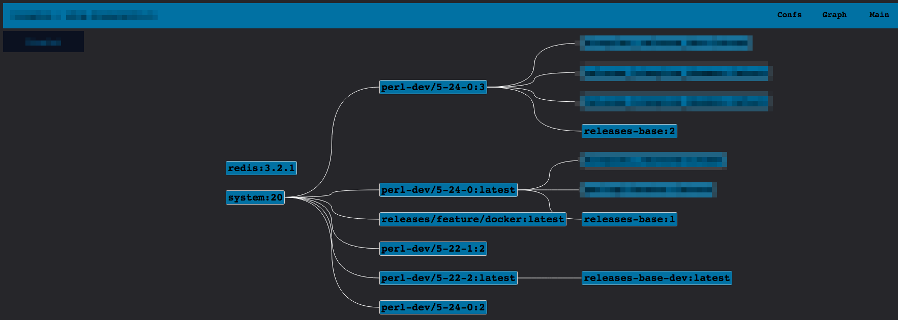

Bow
==
## As simple as possible frontend for your private docker registry
Pictures
==
  




Features
==  
- v2 registry support only
- scary templates and interface in whole
- internal db (BoltBD) gives it ability to store info, and as result it responses much more faster then after direct api call
- app can pars, store and show info from registry such as:
 - image layers info:
   - name / tag
   - image size and pushes number
   - upload and push dates
 - image creating commands history
- it is possible to set multiple repositories and watch all registries in one place
- show short info card for tag
- show statistics pretty, draw curves for uploads number and image sizes for tag with respects to dates
- __(new)__ find parent of image, in case parent in the same repo (it is clickable!)
- __(the newes)__ show tree of parents for image/ build dependency tree for whole repo


Prospects
==
I can say that this app almost fit my needs, so in all likelyhood, soon, I will not improve it hardly, but this is the list of ideas just for case:
- delete tags/images from repo just by click
- make improvements on interface and visual side
- dynamically upload nice images from __icons8.com__ API

How to start use Bow
==
```
docker run -d \
   --name=Bow \
   -e BS_LOG_SILENT=yes \
   -v /home/$(whoami)/db/bow:/var/lib/bow \
   -p 12345:19808 \
   evedel/bow
```
How to start contribute to Bow
==
If you have interest, you can easily start with
```
git clone https://github.com/evedel/bow.git
cd bow
docker-compose -f develop/devlinux.yml up -d
docker exec -it develop_golang_1 go get
docker exec -it develop_golang_1 go run main.go
```
Code and packages
==
This app is written on golang with use of standard packages and:  
https://github.com/boltdb/bolt -- BoltDB  
https://github.com/fatih/color -- to make cli shiny  
https://github.com/wader/disable_sendfile_vbox_linux -- to develop on docker-machine  
http://www.chartjs.org/ -- to draw best graphs ever
https://github.com/fperucic/treant-js -- to draw parents graphs
