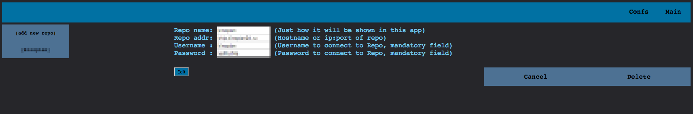
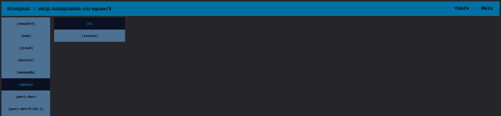

Bow
==
## As simple as possible frontend for your private docker registry
As for my purposes, now there is no enough simple but powerful docker-registry frontend.  
For me I found only two general ways:  
- the first one is authorithation service, but this is much more complicated than I wanted;
- the second one is [kwk/docker-registry-frontend](https://github.com/kwk/docker-registry-frontend), but, with all respect to author, that, in other hand, looks not enough powerful for me;  

The solution comes to me with this __Bow__ (kinda bowship).

Some pictures
==
  



At the moment (initial commit) it has
==  
## Great minuses
- v2 registry support only
- ability to show the list of repos/names/tags only
- scary templates and interface in whole only
- __it stores you password for registry as raw text so it is needed to hide this frontend at least under httbasic auth__

## But also a couple of pluses
- internal db gives it ability to store info and as result it responses much more faster then after direct api call after each click
- already realized ability to parse and storing lot of info from registry such as
 - image layers info
 - image creating commands history
 - total image size
 - number of pushes in tag/image
   - emphasize, it can't __show__ all above right at the moment =(
- it is possible to set multiple repositories and watch all in one place

## Bow milestons
I strongly intended to improve it, so closest changes in the road are:
- print info for tag (layers, size, pushes, created commands)
- delete tags/images from repo just by click
- show statistics pretty, draw curves of uploads and sizes for tag/image/repo
- interface and visual improvement

How to start use Bow
==
```
docker run -d \  
   -e BS_LOG_SILENT=yes\
   -v /home/$(whoami)/db/bow:/var/lib/bow\
   -p 12345:19808\
   evedel/bow
```
How to start contribute to Bow
==
If you have interest to you can easily start with
```
git clone https://github.com/Evede1/bow.git
cd bow
docker-compose -f develop/devlinux.yml up -d
docker exec -it develop_golang_1 go get
docker exec -it develop_golang_1 go run main.go
```
Code and packages
==
This app is written on golang with use of standard packages and:  
https://github.com/boltdb/bolt#using-buckets -- BoltDB  
https://github.com/fatih/color -- to make cli shiny  
https://github.com/wader/disable_sendfile_vbox_linux -- to develop on docker-machine
